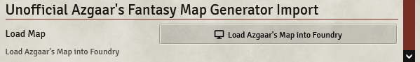
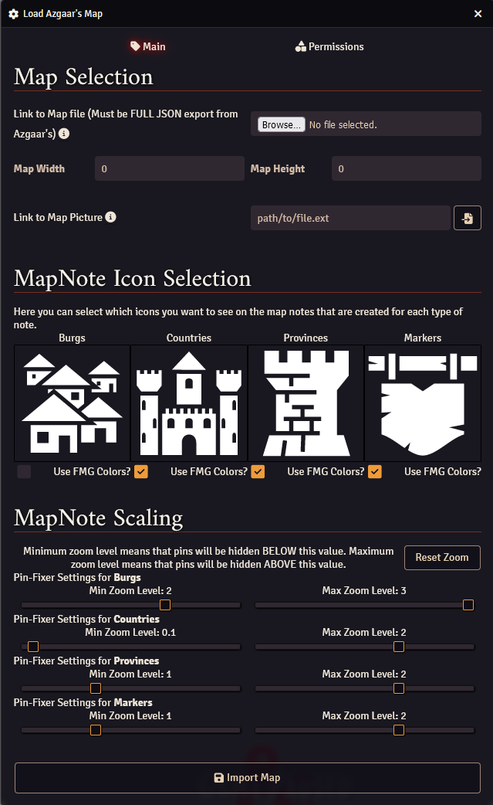

# Unofficial Azgaar's Fantasy Map Generator Import

## Important note regarding pictures from FMG

For your map to be of the right size when exporting a picture, ensure that you are exporting the picture from the SAME machine that you used to generate the map. This will ensure that the exact screen dimensions of your browser are captured so that everything lines up in Foundry.

## New Features!

-   A complete rewrite of the module for v12 compatibility and to use the much nicer FULL JSON exports from Azgaar's which contains more information!
-   Support for Markers (including one page dungeons, random encounters, etc. all being linked in the Foundry journal!)
-   Fixed several bugs that could occur when updating the same compendium over and over.

## How to use

### Azgaar's Fantasy Map Generator (FMG)

In order to use this module you will first need to retrieve two files from Azgaar's Fantasy Map Generator (https://azgaar.github.io/Fantasy-Map-Generator).
You will need the FULL JSON export file and a picture of your world. Once you have these, continue to the next step.

### Starting the Workflow

To start please navigate to the Module settings and select the "Load Azgaar's Map into Foundry" button.

### The Form

First and foremost I'd like to say that this form appears a lot more daunting than it actually is, so here's a bunch a pictures to help guide you.

There are only 3 steps that you actually _have_ to do, the rest is just configuring.

#### Section 1 - Map Selection

First we want to load our map file into Foundry. We can do this by selecting the "Browse..." button and giving it our map file.

Once the map file is loaded we'll want to click the giant "Link to Picture" button and feed it the picture we exported from FMG.

Those are the only mandatory steps in this section (and pretty much the whole form), but the configuration really helps make these maps yours.

#### Section 2 - MapNote Icon Selection

In this section you can change the icon(s) that are used in the map notes that are generated by this module. For example we can change Countries to show the City svg instead of the default tower.

#### Section 3 - MapNote Scaling

This module utilizes the pin-fixer module to allow some notes to be hidden based on zoom level. For any randomly generated map from FMG there are literally a thousand plus burgs, and I don't know about you but I don't need to see them all the time (but you can if you want to!)

Like the notice says the minimum zoom level requires you to be zoomed in to that distance to see it (so a really low value like on Countries means you can see it from really far out). The maximum zoom level will hide the note when you zoom in far enough. Using the Countries example again, when you zoom in far enough to see burgs it will hide the Country note so that you can actually see the Burgs.

#### Section 4 - Import

Congrats! If you've reached this far then you've done everything you need to get this to work, and now you can just slam that import button and watch the magic happen!

#### Section 5 - Permissions

If you want more fine-grained permissions (like players being able to edit the journals), then you can change the default permission on the permissions tab.

## How Does It Work?

So you might be asking yourself won't this cause my players to not be able to load in fast? What's the performance impact of having 1000+ map notes on a single scene?

While I can't gurantee that your players won't experience difficulties loading into the scene I have made use of every possible method in Foundry to ensure that it is the quickest it can be. To this end you'll notice that on map creation all of the Journal Entries are actually stored in Compendiums. This means that unless you've opened that Journal recently it is stored in the database and you (and your players!) don't need to load it to log in.

### Updates

Whenever a new update is published you'll need to reimport the map in order to update your journals and see the new configurations! This update will only change the contents of the module-managed page in each journal, so you're free to add additional notes on other pages!

## Future Plans

-   Find a way to allow updating of journals via a separate window so we don't have to create another new scene.
-   Incorporate other dataset(s) from the FMG map file
-   Find better ways to display _most_ of the data.

## Contact, Issues, and Recommendations

If you have any desire to contact me feel free to send me a message on Discord (Ethck). Additionally if you run into any issues with the program and/or have any recommendations for future development please do not hesitate to post an issue here on Github.

## Additional Licensing & Thanks

This work is also licensed under the

[Foundry Virtual Tabletop EULA - Limited License Agreement for Module Development.](https://foundryvtt.com/article/license/)

I want to give a special shout-out to Azgaar for making the Fanatasy Map Generator in the first place and a shout out to all those who have helped contribute to this over the last several months, especially TheSnarky who has helped clean up some of my god-awful UI designs
